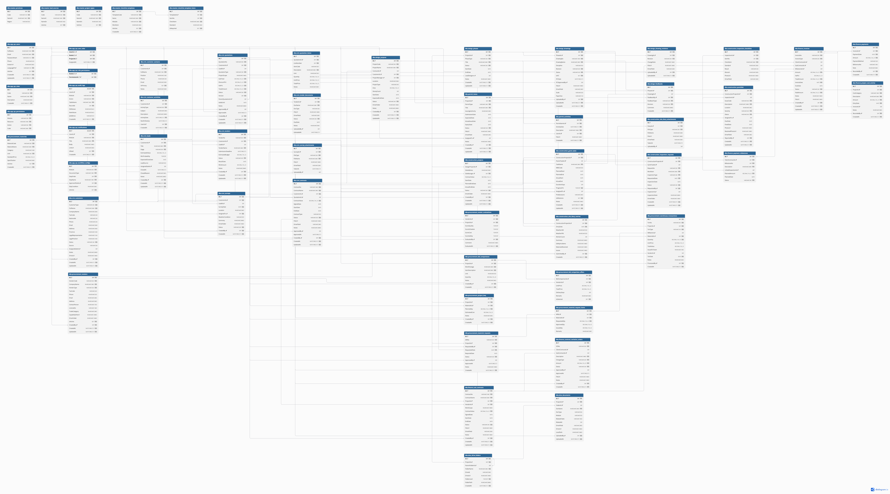

# Nihome31042025

This project is using
1. ASP.NET Core MVC(.NET 8). Version 8.0.4
2. Entity Framework Core 8.
3. SQL Server 2022

## For Docker dev
If you are using the docker, simply run

```bash
$ docker compose up -d
```

It will run the SQLServer DB, Web Application, and ASP .NET for you with hot-reload feature.

## Connect to DB with ASP .NET Core

To connect to the MySQL database. If you manage to run ASP .NET with docker.

We need to declare the `appsettings.json` like
```json
"ConnectionStrings": {
    "DefaultConnection": "Server=host.docker.internal,1433;Database=NihomeDB;User Id=sa;Password=Nihome@31042025;TrustServerCertificate=True;"
}
```

Otherwise if you are running thee ASP .NET in local dev.

We need to declare the `appsettings.json` like
```json
"ConnectionStrings": {
    "DefaultConnection": "Server=localhost,1433;Database=NihomeDB;User Id=sa;Password=Nihome@31042025;TrustServerCertificate=True;"
}
```

## How to run dotnet

```bash
cd nihomebackend
dotnet run
```

Run with hot reload (auto refresh when you edit code).

```bash
dotnet watch run
```

Best for development because it recompiles automatically when you modify files.

## Swagger

Swagger is enabled only in the `Development` environment.

For the standard development setup in this repository, use:

- Swagger UI: `http://localhost:5043/swagger`
- OpenAPI JSON: `http://localhost:5043/swagger/v1/swagger.json`

## WorkProcesses legacy import

Process images and downloadable files are stored on disk under `nihomebackend/wwwroot/process-assets` and referenced from SQL Server through `process_assets` metadata rows. In Docker, this path is backed by the `nihome_process_assets` named volume; include that volume in backups together with the database.

To import legacy WorkProcesses from `https://nicon.vn`, set credentials outside git:

```bash
export NICON_LEGACY_EMAIL="admin@example.com"
export NICON_LEGACY_PASSWORD="..."
```

Then call the admin-only endpoint:

```bash
curl -X POST http://localhost:5043/api/processes/import/legacy \
  -H "Authorization: Bearer <admin-token>" \
  -H "Content-Type: application/json" \
  -d '{"dryRun":true}'
```

Run with `{"dryRun":false}` only after reviewing the dry-run counts and taking a DB backup. The apply run replaces the existing process rows for the 8 legacy groups.

Check the SQL Server database is created

```bash
docker run --platform linux/amd64 -it --rm --network container:nihome31042025-sqlserver mcr.microsoft.com/mssql-tools /opt/mssql-tools/bin/sqlcmd -S localhost -U sa -P "Nihome@31042025"

1> select name from sys.databases;
2> go

name                                                                                                                            
--------------------------------------------------------------------------------------------------------------------------------
master                                                                                                                          
tempdb                                                                                                                          
model                                                                                                                           
msdb                                                                                                                            
NihomeDB
```

### Useful SQL Commands

List all tables:

```sql
SELECT TABLE_NAME FROM INFORMATION_SCHEMA.TABLES WHERE TABLE_TYPE = 'BASE TABLE';
GO
```

Describe a table (show columns, types, nullability):

```sql
EXEC sp_columns @table_name = 'YourTableName';
GO
```

Quick column overview:

```sql
SELECT COLUMN_NAME, DATA_TYPE, IS_NULLABLE, CHARACTER_MAXIMUM_LENGTH
FROM INFORMATION_SCHEMA.COLUMNS
WHERE TABLE_NAME = 'YourTableName';
GO
```

Show all indexes on a table:

```sql
EXEC sp_helpindex 'YourTableName';
GO
```

For SQL Server Cheat Sheet Command, please look at: [SQL Server Cheat Sheet](docs/sqlserver_cheatsheet.md).

## IMPORTANT

When you attempt to add new model in `Models/`
1. Adding a new Model class.
2. Adding a new Property to a Model.
3. Renaming a property.
4. Chaing data types.
5. Adding a foreign key.
6. Adding a new table.
7. Changing relationships (1 - Many, Many - Many).
8. Renaming a table.

These changes affect how EF Core expects the SQL Database to look. So you must run following commands:

```bash
dotnet ef migrations add <Migration Name>
dotnet ef database update
```

Migrations/ folder stores schema history. You only delete the folder if intentionally want to recreate the database from scratch.

## JIRA ticket
https://endava-team-nawxok20.atlassian.net/jira/software/projects/NIH/boards/3

## WoW
1. Create the merge request, write clear commit message before push.
2. For the backend, need to wait for the workflow CI passed before merge.
3. Resolve all conflicts, review requests before merge.


## SQL Schema

