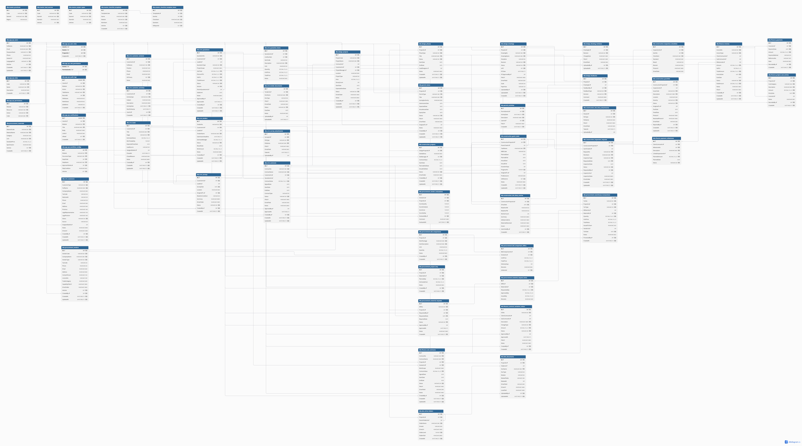

# Nihome31042025

Nihome is a React 18 + ASP.NET Core 8 platform backed by Entity Framework Core 8 and SQL Server 2022. The repository includes public content management, recruitment, CRM-related workflows, and construction operations such as partial acceptance, as-built dossiers, punch lists, and project handover.

## Docker development

Docker Compose is the supported development environment. Start the complete stack with:

```bash
docker compose up -d --build
```

The application is available at `http://localhost:5043`. The backend container is named `nihome31042025-backend`, and SQL Server runs in `nihome31042025-sqlserver`.

## Connect ASP.NET Core to SQL Server

The Docker Compose environment supplies the application connection string. For an external development configuration that connects to the Docker-hosted SQL Server, use:

We need to declare the `appsettings.json` like
```json
"ConnectionStrings": {
    "DefaultConnection": "Server=host.docker.internal,1433;Database=NihomeDB;User Id=sa;Password=<development-password>;TrustServerCertificate=True;"
}
```

For a tool running directly on the host, use:

We need to declare the `appsettings.json` like
```json
"ConnectionStrings": {
    "DefaultConnection": "Server=localhost,1433;Database=NihomeDB;User Id=sa;Password=<development-password>;TrustServerCertificate=True;"
}
```

## Connect Google Drive with OAuth

Project documents use a Google OAuth user credential for personal My Drive. Deployment configuration supplies the client identity, callback URI, and root folder. An administrator connects the account from **Settings > Google Drive**; the backend encrypts the refresh token with ASP.NET Core Data Protection and stores only ciphertext in SQL.

> **Security:** `ClientSecret`, refresh tokens, and Data Protection keys are secrets. Never commit real values, paste them into tickets or logs, or add them to `deployment-config`. Persist and access-control the Data Protection key ring or stored credentials cannot be decrypted after deployment.

### 1. Create or select a Google Cloud project

1. Open the [Google Cloud Console](https://console.cloud.google.com/).
2. Create a project or select the project dedicated to Nihome.
3. Record the project name so the OAuth client and Drive API are created in the same project.

### 2. Enable Google Drive API

1. Open **APIs & Services > Library**.
2. Search for **Google Drive API**.
3. Select it and click **Enable**.

### 3. Configure Google Auth Platform

1. Open **Google Auth Platform** in the selected project.
2. Under **Branding**, enter the application name and required support/developer contact details.
3. Under **Audience**, select:
    - **Internal** when only users in one Google Workspace organization will connect; or
    - **External** for other Google accounts.
4. If the app is **External** and in **Testing**, add the Google account that owns or can edit the target Drive folder as a test user.
5. Under **Data Access**, add exactly this scope:

    ```text
    https://www.googleapis.com/auth/drive
    ```

This project currently requires the full Drive scope because the worker finds, creates, uploads, reconciles, and deletes managed files beneath the configured root folder. Google classifies this as a restricted scope. An external production application may require Google OAuth verification and, depending on how restricted data is stored or transmitted, a security assessment.

### 4. Create a Web OAuth client

1. Open **Google Auth Platform > Clients**.
2. Click **Create client**.
3. Select **Web application** as the application type.
4. Register the exact backend callback URI, for example `https://nicon.example.com/api/site-settings/google-drive/oauth/callback`.
5. Keep the downloaded `client_id` and `client_secret` private until an authorized administrator enters them in **Settings > Google Drive**. A Desktop OAuth client with only `http://localhost` cannot serve a deployed HTTPS callback.

### 5. Save the configuration and connect the account

Sign in to Nicon with `system.settings.manage` and open **Settings > Google Drive**. Enter the OAuth client ID, write-only client secret, exact callback URI, internal Admin return path, root folder ID, stable deployment instance ID, application name, business folder paths, Drive compatibility mode, and polling interval. Save before selecting **Connect Google Drive**. Nicon opens Google sign-in in a popup, Google asks which account to use and requests consent, then the popup closes after the callback. Nicon encrypts both the client secret and issued refresh token in SQL; revoked access is reported as **Reconnect required**.

To use another Google account, select **Disconnect** to remove the current Nicon credential and request revocation from Google, then select **Connect Google Drive** and choose the replacement account. **Switch Google account** performs the same disconnect first, then opens Google's account chooser. If Google cannot confirm revocation, Nicon remains locally disconnected and shows manual-revocation guidance. If the replacement authorization is cancelled or fails, Nicon remains disconnected rather than silently retaining the previous account.

### 6. Create and authorize the root Drive folder

1. In Google Drive, sign in with the account authorized in the previous step.
2. Create or select the folder that will contain Nihome-managed content.
3. Ensure the authorized account is the owner or has permission to add and delete files:
    - **Editor** for a folder in My Drive; or
    - **Contributor**, **Content manager**, or **Manager** as permitted by the Shared Drive policy.
4. Open the folder. For a URL in this form:

    ```text
    https://drive.google.com/drive/folders/<FOLDER_ID>
    ```

        copy only `<FOLDER_ID>` into the **Root folder ID** field in **Settings > Google Drive**.

### 7. Configure Data Protection key persistence

Google Drive business settings and OAuth credentials are not read from `appsettings.json` or `GoogleDrive__*` environment variables. They are managed only from the Admin page. Deployment configuration owns only the ASP.NET Core Data Protection key-ring location used to decrypt the SQL ciphertext after restarts.

```text
DataProtection__KeysPath=/secure/nicon/data-protection-keys
```

Persist that directory across deployments and restrict it to the application identity and responsible administrators. Losing the key ring makes existing encrypted secrets unreadable and requires entering the client secret and reconnecting again.

### 8. Verify the connection

Configuration saves take effect without restarting the backend. After connecting, confirm **Settings > Google Drive** reports **Connected** with the expected account and root folder, then upload a controlled project file and verify its Drive link.

Connection status troubleshooting:

| Status | Check |
|--------|-------|
| `Unavailable` | Confirm all four values are present, Drive API is enabled, the refresh token was issued with the Drive scope, and the test user still has access. |
| `ReadOnly` | Grant the authenticated account permission to add and delete files in the root folder. |
| `InvalidRoot` | Confirm `RootFolderId` identifies a live folder rather than a file or a trashed folder. |
| `invalid_grant` in logs | The refresh token was expired, revoked, or issued for a different client. Repeat step 5 with the same OAuth client and account. |

OAuth apps left in **Testing** can issue refresh tokens with a limited lifetime. Before production use, publish the app and complete any Google verification required for the Drive scope. See the [Google installed-app OAuth guide](https://developers.google.com/identity/protocols/oauth2/native-app) and [Drive scope guide](https://developers.google.com/workspace/drive/api/guides/api-specific-auth) for current requirements.

## Backend commands

```bash
docker exec nihome31042025-backend dotnet build
docker exec nihome31042025-backend dotnet format --verify-no-changes
```

The Compose backend mounts only the application project, not the sibling test projects, and the current image does not install `dotnet-ef`. CI runs unit/integration tests in a full .NET 8 SDK checkout. See the developer guide for current test and migration prerequisites.

EF Core syntax from a .NET 8 SDK environment with `dotnet-ef` 8.x is:

```bash
dotnet ef migrations add <MigrationName>
dotnet ef database update
```

Keep database work isolated from the host SQL Server and review generated migration files before applying them.

## Swagger

Swagger is enabled only in the `Development` environment.

For the standard development setup in this repository, use:

- Swagger UI: `http://localhost:5043/swagger`
- OpenAPI JSON: `http://localhost:5043/swagger/v1/swagger.json`

Check the SQL Server database is created

```bash
docker run --platform linux/amd64 -it --rm --network container:nihome31042025-sqlserver mcr.microsoft.com/mssql-tools /opt/mssql-tools/bin/sqlcmd -S localhost -U sa -P "<development-password>"

1> select name from sys.databases;
2> go

name                                                                                                                            
--------------------------------------------------------------------------------------------------------------------------------
master                                                                                                                          
tempdb                                                                                                                          
model                                                                                                                           
msdb                                                                                                                            
NihomeDB
```

### Useful SQL Commands

List all tables:

```sql
SELECT TABLE_NAME FROM INFORMATION_SCHEMA.TABLES WHERE TABLE_TYPE = 'BASE TABLE';
GO
```

Describe a table (show columns, types, nullability):

```sql
EXEC sp_columns @table_name = 'YourTableName';
GO
```

Quick column overview:

```sql
SELECT COLUMN_NAME, DATA_TYPE, IS_NULLABLE, CHARACTER_MAXIMUM_LENGTH
FROM INFORMATION_SCHEMA.COLUMNS
WHERE TABLE_NAME = 'YourTableName';
GO
```

Show all indexes on a table:

```sql
EXEC sp_helpindex 'YourTableName';
GO
```

## IMPORTANT

When you attempt to add new model in `Models/`
1. Adding a new Model class.
2. Adding a new Property to a Model.
3. Renaming a property.
4. Chaing data types.
5. Adding a foreign key.
6. Adding a new table.
7. Changing relationships (1 - Many, Many - Many).
8. Renaming a table.

These changes affect how EF Core expects the SQL database to look. Generate and review a migration in the Docker-based .NET 8 SDK tooling environment described in the developer guide, then apply it only after review:

```bash
dotnet ef migrations add <MigrationName>
dotnet ef database update
```

The `Migrations/` folder is shared schema history and must not be deleted to reset development data. For a disposable Compose database, use `docker compose down -v` and start the stack again.

## JIRA ticket
https://endava-team-nawxok20.atlassian.net/jira/software/projects/NIH/boards/3

## Documentation

- Developer setup, architecture, migrations, testing, and deployment: [`docs/application_developer.md`](docs/application_developer.md)
- Product workflows and API reference: [`docs/user_guide.md`](docs/user_guide.md)
- Roles and permission behavior: [`docs/users-rbac.md`](docs/users-rbac.md)
- Browser test operation: [`nihomeweb/e2e/README.md`](nihomeweb/e2e/README.md)

## WoW
1. Create the merge request, write clear commit message before push.
2. For the backend, need to wait for the workflow CI passed before merge.
3. Resolve all conflicts, review requests before merge.


## SQL Schema


## For convience, run the auto-deployment.sh to auto script
```bash
$ ./auto-deployment.sh
```

Use `deployment-config/output/publish-release.zip` as the IIS hosting artifact.